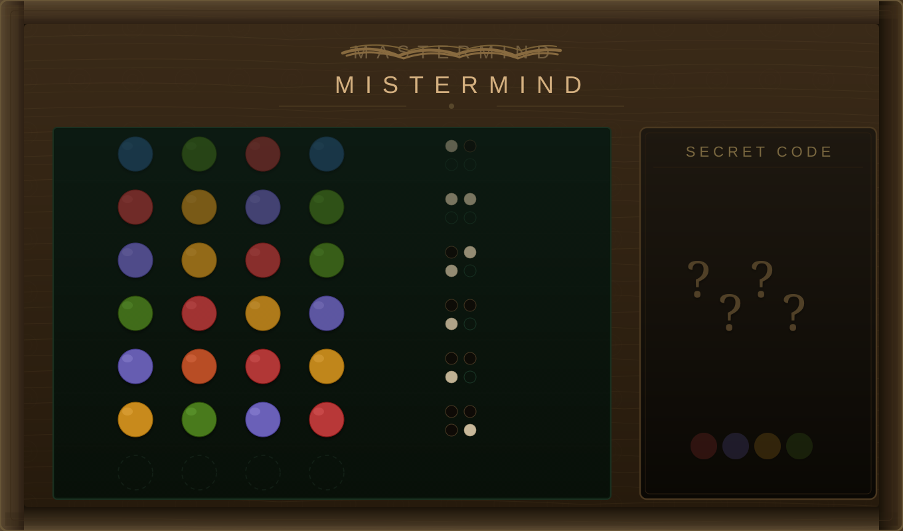
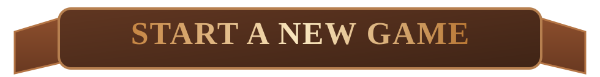
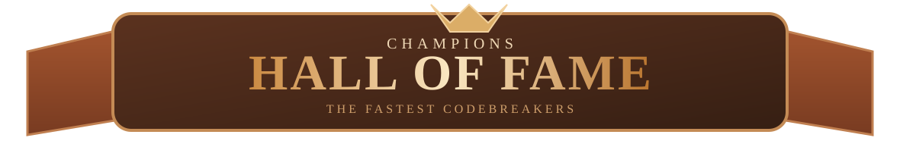
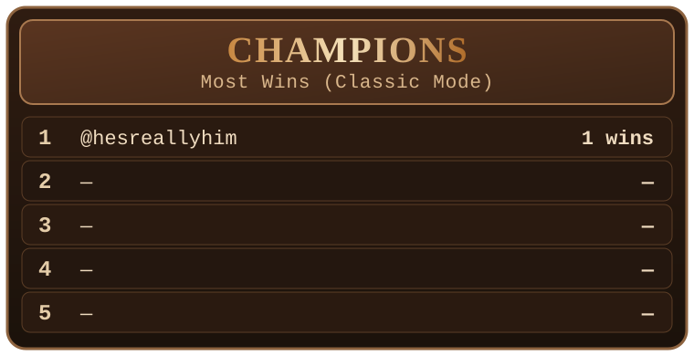
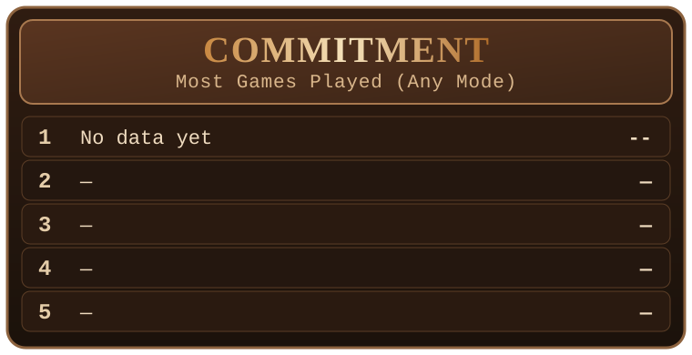
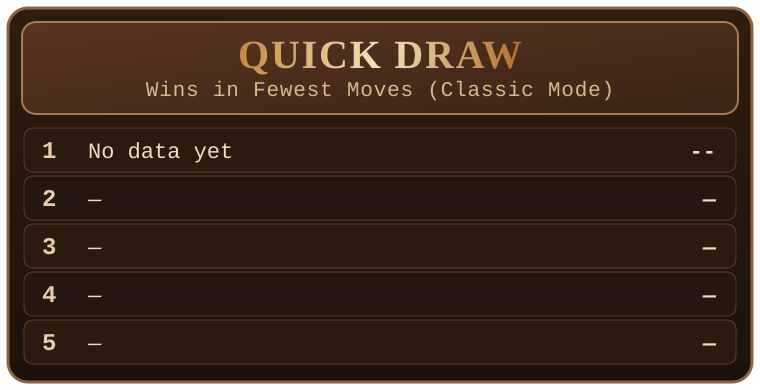
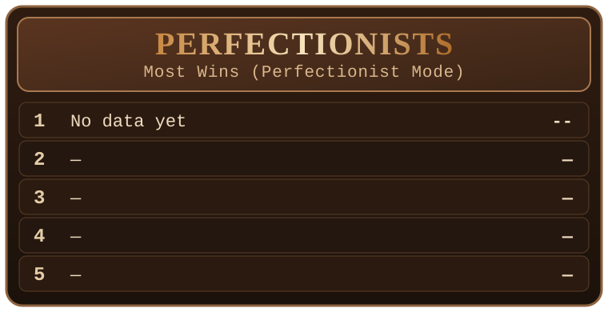

<picture></picture>

<picture></picture>

# Welcome, codebreaker.

## Use your powers of _deduction_ to break MisterMind's code.

## To start your own personal game, just open a new issue.

## And don't forget to have fun, share it with others, feel _FREE_, always give proper attribution per the repo's LICENSE file, be nice to the servers and to the maintainer and to MisterMind and read the holy CONTRIBUTING.md and CODE_OF_CONDUCT.md, express yourself, and don't forget to _SMASH THAT STAR BUTTON LET'S GO IT'S GAME TIME ARE YOU READY TO PLAY THE GAME AND TRY TO WIN AT IT BECAUSE IF THE ANWER IS AFFIRMATIVE THEN GET READY TO HAVE SOME FUN AND PLAY A GAME AND READ THE CODE OF CONDUCT LET'S GOOO!_

<picture></picture>

 

- 6 colors to choose from

| red | blue | green | yellow | orange | purple |
|---|---|---|---|---|---|
| 🔴 | 🔵 | 🟢 | 🟡 | 🟠 | 🟣 |

- A secret sequence of 4 colored pegs
- Duplicate colors are allowed
- 10 attempts to crack the code
- Feedback is given by MisterMind after each turn:
  - Color and position
  - Color only
  - Neither color nor position
- Feedback gives aggregate counts only, _not_ which peg is which

<picture></picture>

To make a guess, just comment in your game room with four letters, or abbreviations

- `red blue green yellow`
- `r b g y`
- `rbgy`
- `r green by`
- Or, `/guess red blue green yellow`

Additional command:

- `/giveup`

<picture></picture>

- One active room per player
- Only the room owner can play that room - other commenters have no effect (although excessive comments will be monitored for spam)
- Wait for MisterMind to respond before your next command

<picture></picture>

<!-- MM_LEADERBOARD_START -->
### Leaderboards
_As of (UTC): 2026-04-10T17:44:45+00:00 from 0 completed games_
(Leaderboards are updated roughly every 15 minutes)

<table align="center">
  <tr>
    <td><picture></picture></td>
    <td><picture></picture></td>
  </tr>
  <tr>
    <td><picture></picture></td>
    <td><picture></picture></td>
  </tr>
</table>

<em>No completed games yet.</em>
<!-- MM_LEADERBOARD_END -->
